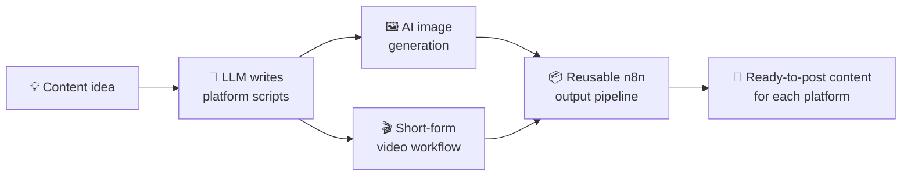

<p align="center">
  
</p>

<p align="center">
  <a href="https://github.com/mohit9998A">
    
  </a>
</p>

<p align="center">
  <a href="https://www.linkedin.com/in/mohitduttaai/"></a>
  <a href="https://github.com/mohit9998A/"></a>
  <a href="https://leetcode.com/u/mohitcod"></a>
  <a href="https://huggingface.co/Mohitaiengineer"></a>
</p>

<p align="center">
  
</p>

---

## 👨‍💻 About me

I'm **Mohit Dutta**, an AI engineer from Ludhiana, Punjab. I work across Generative AI, RAG, voice AI, computer vision and automation, and I care most about the part many projects skip: turning a model into a system people actually use.

```yaml
currently_building: Bonn, a multilingual AI voice receptionist (Punjabi, Hindi, Hinglish, English)
studying:           MCA in AI & Machine Learning, Chandigarh University
research:           Smart Toll Tax System with IoT + AI (Indian patent application)
ask_me_about:       RAG, voice agents, LiveKit, n8n, YOLO + OCR pipelines
```

<p align="center"></p>

---

## 🎙️ Flagship: Bonn AI Receptionist

A real-time voice agent that answers business calls in the caller's language and responds from the company's own knowledge base.

<p align="center"></p>

| Layer | What it does | Built with |
|---|---|---|
| 🎧 Voice | Real-time conversation | LiveKit |
| 🗣️ Speech | Listens and speaks in Punjabi, Hindi, Hinglish and English | Sarvam AI, ElevenLabs |
| 📚 Knowledge | Answers from company documents | RAG, embeddings, Hugging Face |
| ☎️ Telephony | Connects to real business phone lines | Exotel SIP |
| 🔄 Automation | Triggers actions after the call | n8n, webhooks, REST APIs |

---

## 🚀 Featured projects

### 🎯 ANPR System
Automatic number plate recognition with deep learning and OCR.

<p align="center"></p>

<a href="https://github.com/mohit9998A/ANPR-system"></a>


### 🤖 GenAI Social Media Marketing Automation
An end-to-end n8n pipeline that turns one idea into ready-to-post content for every platform.



<a href="https://github.com/mohit9998A/N8n-Social-Media-Marketing-Automation"></a>


### 🛒 AI Commerce Intelligence
AI-driven customer intelligence and product workflow automation for modern e-commerce.

<a href="https://github.com/mohit9998A/AI-Commerce-Intelligence-"></a>


---

## 🛠️ Tech stack

<p align="center"></p>

<p align="center">
  
</p>

---

## 🏆 Milestones

<p align="center"></p>

<details>
<summary><b>Patent details</b></summary>
<br>

| Field | Detail |
|---|---|
| Title | Next Generation Smart Toll Tax System, IoT & AI |
| Application no. | 2025111110608 |
| Domain | AI, IoT, computer vision, intelligent transportation |
| Status | Application filed. Verify current status on the [Indian Patent Office public search](https://iprsearch.ipindia.gov.in/PublicSearch/). |

</details>

---

## 📊 GitHub activity

<p align="center">
  
</p>
<p align="center">
  
  
</p>
<p align="center">
  
</p>

---

## 🔭 Currently exploring

| GenAI | Real-time AI | AI systems | Engineering |
|---|---|---|---|
| Agentic AI | Voice agents | Production RAG | Model deployment |
| Local LLMs | Streaming AI | AI automation | AI infrastructure |
| RAG architecture | Telephony | Computer vision | Performance tuning |
| Multimodal AI | | AI + IoT | |

---

## 🤝 Let's build something

Open to collaborating on **Generative AI, RAG, voice AI, computer vision, AI automation, AI + IoT** and open source.

<p align="center">
  <a href="https://www.linkedin.com/in/mohitduttaai/"></a>
  <a href="https://huggingface.co/Mohitaiengineer"></a>
</p>

<p align="center"><b>THINK → BUILD → AUTOMATE → DEPLOY → IMPROVE</b></p>
<p align="center"><sub>Build something intelligent. Make it useful. 🚀</sub></p>
